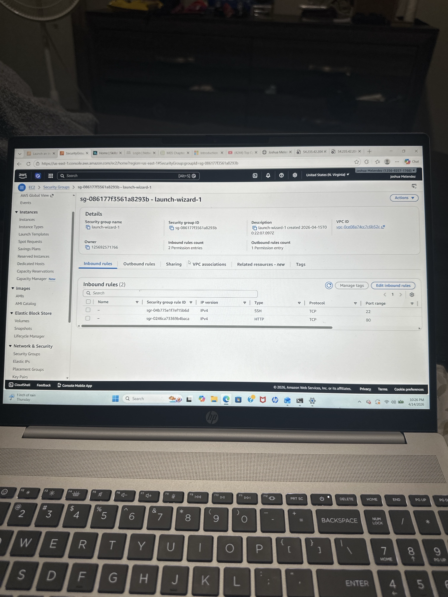
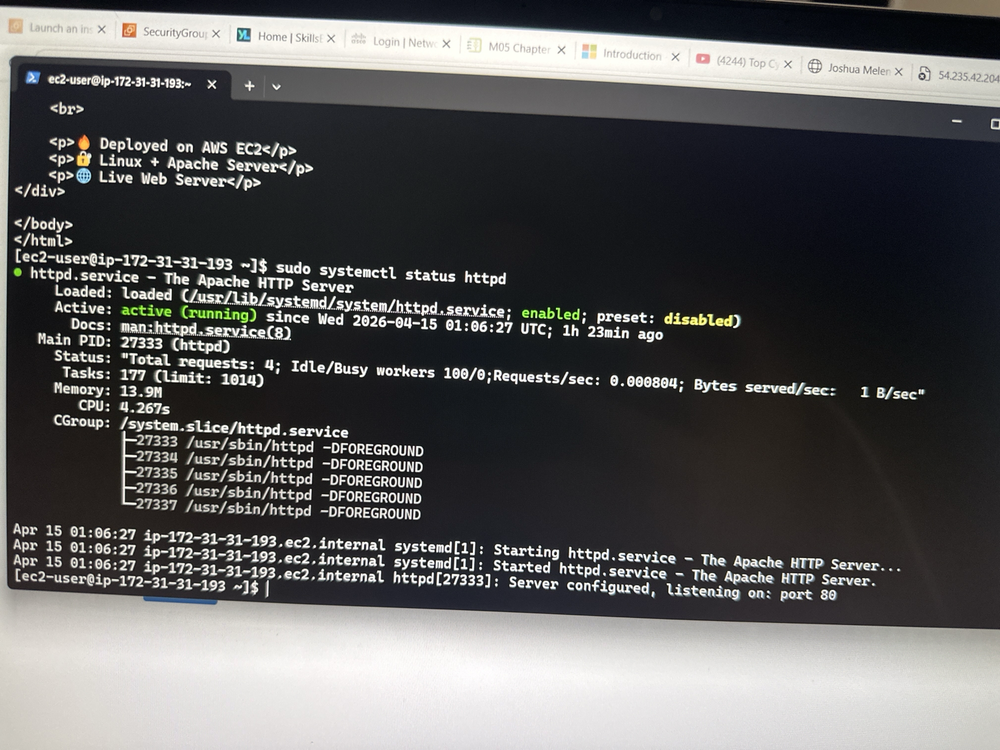
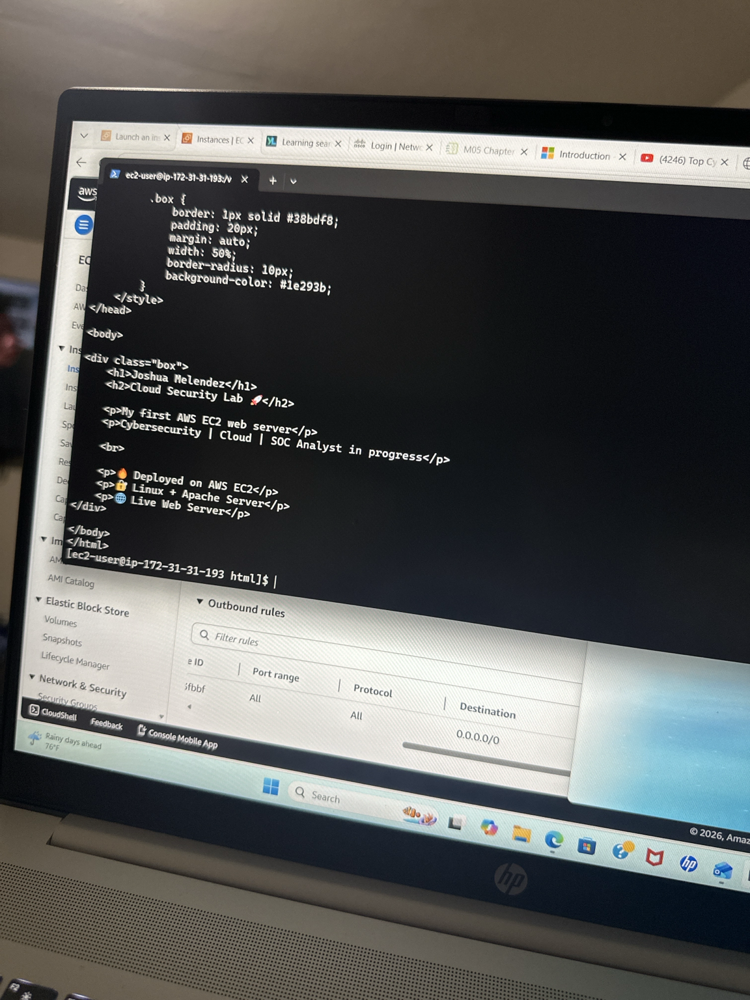
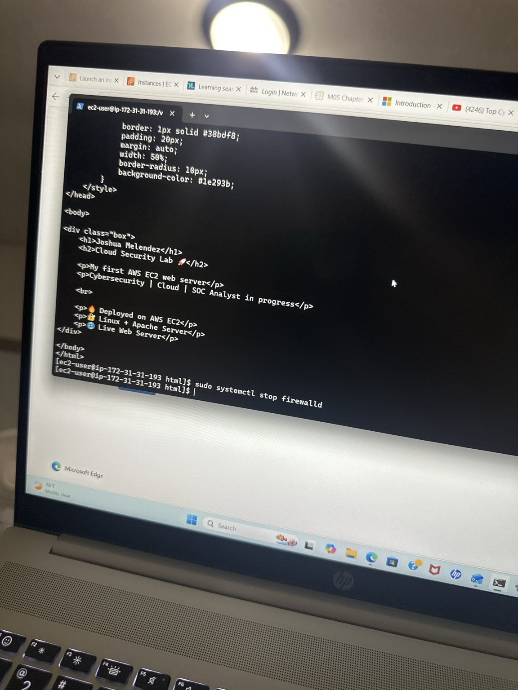
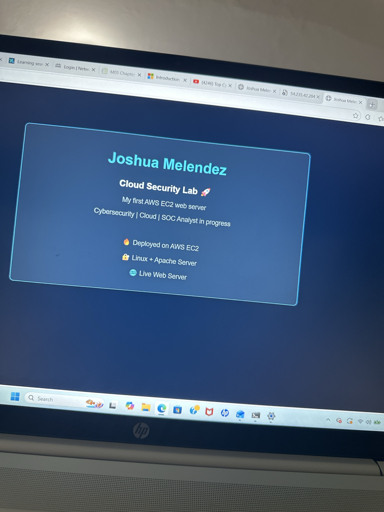
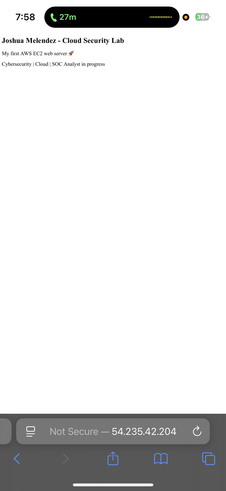

# AWS-ec2-security-lab
Hands-on AWS lab creating EC2 instance, configuring security groups, and analyzing system activity
# ☁️ AWS EC2 Security Lab

## 📌 Objective
The goal of this lab was to gain hands-on experience with AWS by creating and securing an EC2 instance while analyzing system activity.

---

## 🛠 Tools Used
- AWS EC2
- Linux (Ubuntu)
- SSH
- AWS Security Groups

---

## 🧪 Lab Activities

### 1. EC2 Instance Setup
- Created an EC2 instance in AWS
- Selected instance type
- Configured key pair for SSH access

### 2. Security Configuration
- Configured Security Groups
- Allowed SSH (port 22)
- Restricted unnecessary traffic

### 3. Remote Access
- Connected to EC2 using SSH
- Verified system access

### 4. System Monitoring
- Checked system logs
- Reviewed login activity
- Used Linux commands to analyze system behavior

---

## 🔍 Key Findings
- Successfully deployed and accessed EC2 instance
- Configured secure access using SSH
- Learned basic cloud security practice

 📸 Screenshots

---

## 📚 Skills Gained

- AWS cloud fundamentals

- EC2 deployment

- Network security configuration

- Linux command-line usage

